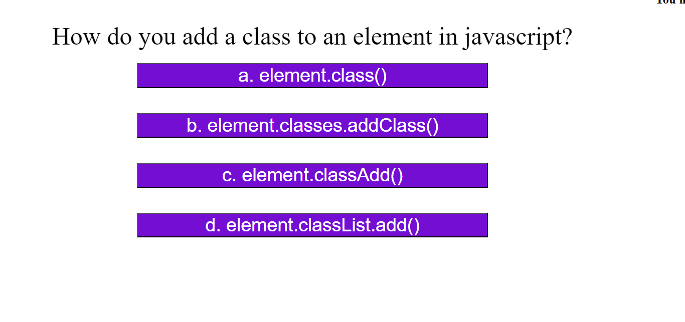
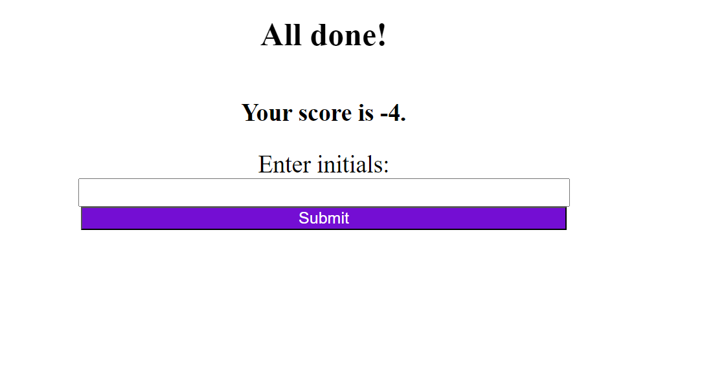

# <Code-Quiz>

## Description

This application is a quiz game containing questions about Javascript. The user is directed through a number of multiple-choice questions under a 100 second timer. At the end of the quiz, the user will be presented with a score and will be able to see other high scores of previous attempts.

## Usage

When you first enter the application, the user will see a start button in the center of the page. Upon clicking the start button, the user is brought to the first of four multiple-choice quiz questions that relate to javascript. In the upper right hand corner, the user will see a timer that starts counting down from 100 seconds upon the clikc of the start button. Each wrong answer chosen by the use drops the seconds by a bigger interval. At the end of the quiz the user is presented with their score which is the amount of time left on the timer once the questions are all answered. The user can then enter their initials and click "submit." This will bring the user to a page that displays their score next to their initials, along with the scores of any previous attemps at the quiz.

[Github Test URL](https://tguils.github.io/code-quiz/)

